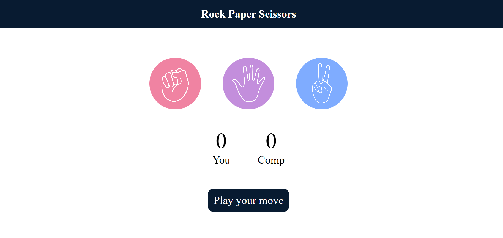
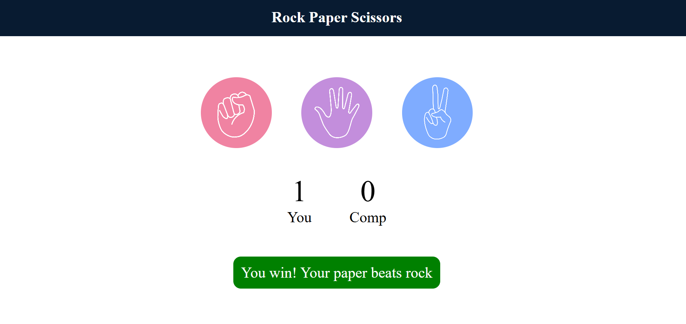
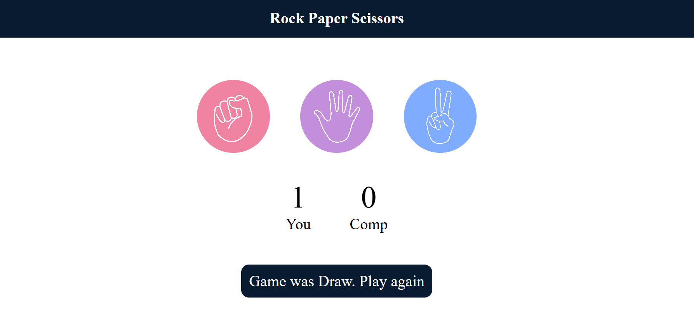
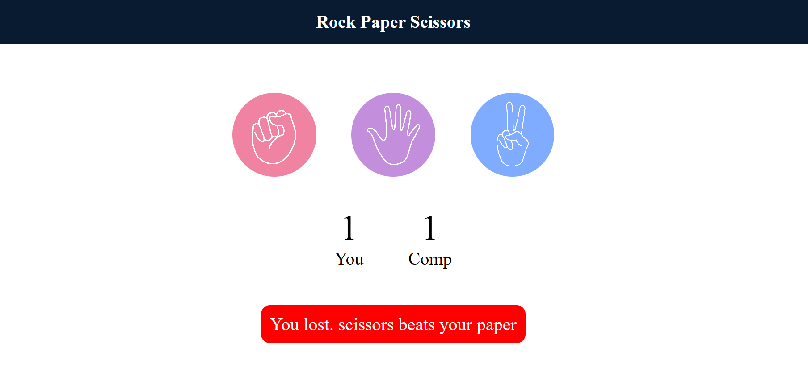

# ✊ Rock Paper Scissors Game

A simple and interactive Rock Paper Scissors game built using HTML, CSS, and JavaScript.

## 🚀 Features

- ✊ Rock option
- 📄 Paper option
- ✂️ Scissors option
- 🤖 Computer generates a random choice
- 🏆 Displays the winner
- 📊 Shows game results
- 🔄 Play again functionality
- 📱 Responsive design

## 🛠️ Technologies Used

- HTML5
- CSS3
- JavaScript

## 🎮 How to Play

1. Choose one of the three options:
   - Rock ✊
   - Paper 📄
   - Scissors ✂️
2. The computer will randomly select an option.
3. The game compares both choices.
4. The winner is displayed on the screen.
5. Play again to start a new round.

## 📸 Screenshots

## 🌐 Live Demo

[Live link.](https://sujalpiprikar01.github.io/Rock-Paper-Scissor/)

## 👨‍💻 Author

**Sujal Piprikar**

GitHub: https://github.com/sujalpiprikar01
